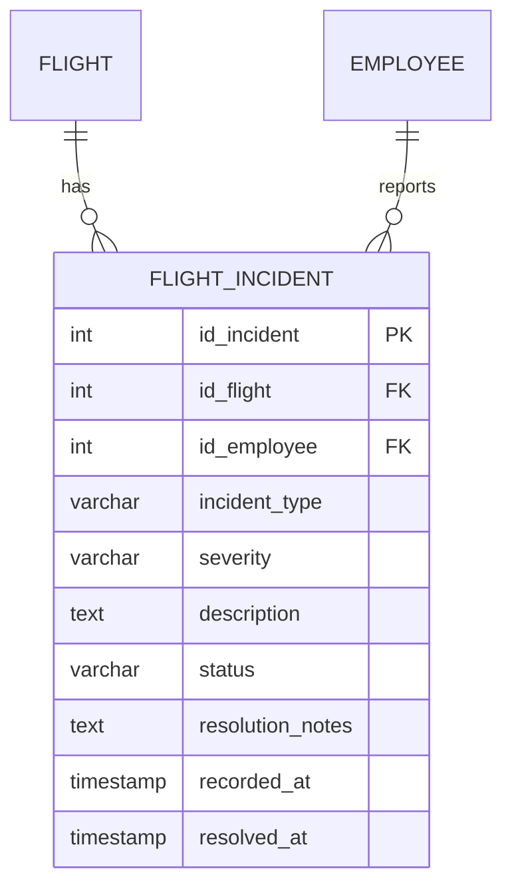

## FLIGHT_INCIDENT

**I said:**

Necesito agregar otra tabla la cual registre incidentes en un vuelo. Los datos que se están contemplando para agregar son id_incident, id_flight FK (FLIGHT), id_employee, incident_type, description y recorded_at. ¿Puedes ayudarme analizando los datos y sugiriendo algún otro si es que hace falta?

**Claude said:**

¡Excelente, colega! Estás agregando **trazabilidad y auditoría de incidentes** al sistema. Muy profesional. 🎯

Vamos a diseñar esta tabla correctamente siguiendo las mejores prácticas.

---

## 🔍 **ANÁLISIS DE TU PROPUESTA:**

### **Campos propuestos:**
```
- id_incident          ✅
- id_flight FK         ✅
- id_employee          ✅
- incident_type        ✅
- description          ✅
- recorded_at          ✅
```

**Tu propuesta está muy bien**, pero necesitamos **refinar algunos detalles**.

---

## 🤔 **PREGUNTAS DE DISEÑO:**

### **1. `id_employee` - ¿Qué empleado?**

Veo que tienes tabla `employee` que referencia a `person` y tiene `id_occupation`.

**Pregunta:** ¿Qué tipos de empleado reportan incidentes?
- ¿Solo pilotos y copilotos?
- ¿Asistentes de vuelo?
- ¿Personal de tierra (mantenimiento, check-in)?
- ¿Supervisores que investigan después?

**Importante:** Necesitamos FK constraint:
```sql
FOREIGN KEY (id_employee) REFERENCES employee(id_person)
```

---

### **2. `incident_type` - ¿VARCHAR o ENUM?**

**Opción A: ENUM (recomendado)**
```sql
incident_type VARCHAR(30) CHECK (incident_type IN (
    'mechanical_failure',
    'medical_emergency',
    'passenger_disturbance',
    'weather_delay',
    'bird_strike',
    'turbulence',
    'fuel_issue',
    'system_malfunction',
    'security_incident',
    'other'
))
```

**Opción B: VARCHAR libre**
```sql
incident_type VARCHAR(50) NOT NULL
```

**¿Cuál prefieres?** ENUM es mejor para reportes y validación.

---

### **3. `description` - ¿Qué tan largo?**

**Opciones:**
- `VARCHAR(500)` → Descripción corta
- `TEXT` → Descripción detallada (recomendado para incidentes)

**Ejemplo de descripción real:**
```
"During descent at FL180, passenger in seat 14C experienced chest pain 
and difficulty breathing. Flight attendant administered oxygen. Pilot 
declared medical emergency and diverted to nearest airport (GDL). 
Paramedics met aircraft on arrival. Passenger transported to hospital. 
Flight continued to destination after 2-hour delay."
```

**Recomendación:** Usa `TEXT` para no limitar información crítica.

---

### **4. ¿Falta información importante?**

**Considera agregar:**

- **`severity`**: ¿Qué tan grave fue?
  - `low`, `medium`, `high`, `critical`

- **`resolved`**: ¿Se resolvió el incidente?
  - `BOOLEAN` o `status` (open/investigating/resolved/closed)

- **`resolution_notes`**: ¿Cómo se resolvió?
  - `TEXT`

- **`resolved_at`**: ¿Cuándo se resolvió?
  - `TIMESTAMP`

---

## ✅ **DISEÑO RECOMENDADO - OPCIÓN A (Completo):**

```sql
CREATE TABLE flight_incident (
    id_incident SERIAL PRIMARY KEY,
    id_flight INTEGER NOT NULL,
    id_employee INTEGER NOT NULL,
    incident_type VARCHAR(30) NOT NULL CHECK (incident_type IN (
        'mechanical_failure',
        'medical_emergency',
        'passenger_disturbance',
        'weather_delay',
        'bird_strike',
        'turbulence',
        'fuel_issue',
        'system_malfunction',
        'security_incident',
        'crew_issue',
        'other'
    )),
    severity VARCHAR(10) NOT NULL CHECK (severity IN ('low','medium','high','critical')),
    description TEXT NOT NULL,
    status VARCHAR(15) NOT NULL DEFAULT 'open' CHECK (status IN ('open','investigating','resolved','closed')),
    resolution_notes TEXT,
    recorded_at TIMESTAMP NOT NULL DEFAULT CURRENT_TIMESTAMP,
    resolved_at TIMESTAMP,
    
    FOREIGN KEY (id_flight) REFERENCES flight(id_flight) ON DELETE RESTRICT,
    FOREIGN KEY (id_employee) REFERENCES employee(id_person) ON DELETE RESTRICT,
    
    CHECK (
        (status IN ('resolved','closed') AND resolved_at IS NOT NULL) OR
        (status IN ('open','investigating'))
    )
);
```

---

## ✅ **DISEÑO SIMPLIFICADO - OPCIÓN B (Básico):**

Si quieres algo más simple para proyecto escolar:

```sql
CREATE TABLE flight_incident (
    id_incident SERIAL PRIMARY KEY,
    id_flight INTEGER NOT NULL,
    id_employee INTEGER NOT NULL,
    incident_type VARCHAR(30) NOT NULL CHECK (incident_type IN (
        'mechanical',
        'medical',
        'passenger',
        'weather',
        'other'
    )),
    description TEXT NOT NULL,
    recorded_at TIMESTAMP NOT NULL DEFAULT CURRENT_TIMESTAMP,
    
    FOREIGN KEY (id_flight) REFERENCES flight(id_flight) ON DELETE RESTRICT,
    FOREIGN KEY (id_employee) REFERENCES employee(id_person) ON DELETE RESTRICT
);
```

---

## 📋 **EXPLICACIÓN DE CAMPOS:**

### **1. `incident_type` - Tipos de incidentes:**

**Mecánicos:**
- `mechanical_failure` → Falla mecánica del avión
- `fuel_issue` → Problema de combustible
- `system_malfunction` → Falla de sistemas (hidráulico, eléctrico, etc.)

**Operacionales:**
- `weather_delay` → Retraso por clima
- `bird_strike` → Impacto con aves
- `turbulence` → Turbulencia severa

**Humanos:**
- `medical_emergency` → Emergencia médica de pasajero/tripulación
- `passenger_disturbance` → Pasajero conflictivo
- `crew_issue` → Problema con tripulación
- `security_incident` → Incidente de seguridad

**Otros:**
- `other` → Otros incidentes

---

### **2. `severity` - Gravedad:**

```sql
'low'      → Incidente menor sin impacto significativo
'medium'   → Requiere atención pero no es urgente
'high'     → Requiere acción inmediata
'critical' → Amenaza la seguridad del vuelo
```

**Ejemplos:**
```sql
-- Baja
incident_type = 'turbulence', severity = 'low'
description = "Ligera turbulencia durante 5 minutos, cinturones ajustados"

-- Media
incident_type = 'passenger_disturbance', severity = 'medium'
description = "Pasajero alterado se negó a apagar dispositivo electrónico"

-- Alta
incident_type = 'medical_emergency', severity = 'high'
description = "Pasajero con dolor en el pecho, se desvió el vuelo"

-- Crítica
incident_type = 'mechanical_failure', severity = 'critical'
description = "Falla en motor izquierdo, aterrizaje de emergencia"
```

---

### **3. `status` - Estado del incidente:**

```sql
'open'          → Recién reportado, no se ha tomado acción
'investigating' → Se está investigando
'resolved'      → Se resolvió, esperando documentación final
'closed'        → Completamente cerrado y documentado
```

**Flujo típico:**
```
open → investigating → resolved → closed
```

---

### **4. Constraint CHECK - Validación:**

```sql
CHECK (
    (status IN ('resolved','closed') AND resolved_at IS NOT NULL) OR
    (status IN ('open','investigating'))
)
```

**Significado:** Si el incidente está resuelto/cerrado, **debe** tener fecha de resolución.

---

## 🔄 **EJEMPLO DE USO:**

### **Caso 1: Emergencia médica durante vuelo**

```sql
-- 1. Asistente de vuelo reporta incidente
INSERT INTO flight_incident VALUES (
    DEFAULT,                              -- id_incident
    150,                                  -- id_flight
    25,                                   -- id_employee (asistente de vuelo)
    'medical_emergency',                  -- incident_type
    'high',                               -- severity
    'Passenger in seat 12B reported chest pain and difficulty breathing. Oxygen administered. Pilot notified and diverted to nearest airport.',
    'open',                               -- status
    NULL,                                 -- resolution_notes
    CURRENT_TIMESTAMP,                    -- recorded_at
    NULL                                  -- resolved_at
);

-- 2. Supervisor investiga
UPDATE flight_incident 
SET status = 'investigating'
WHERE id_incident = 1;

-- 3. Se resuelve
UPDATE flight_incident 
SET 
    status = 'resolved',
    resolution_notes = 'Passenger transported to hospital. Diagnosed with panic attack, not cardiac event. Flight resumed after 2-hour delay.',
    resolved_at = CURRENT_TIMESTAMP
WHERE id_incident = 1;

-- 4. Se cierra tras documentación
UPDATE flight_incident 
SET status = 'closed'
WHERE id_incident = 1;
```

---

### **Caso 2: Falla mecánica**

```sql
INSERT INTO flight_incident VALUES (
    DEFAULT,
    200,
    42,                                   -- id_employee (piloto)
    'mechanical_failure',
    'critical',
    'Warning light for hydraulic system illuminated during cruise. Followed emergency checklist. Declared emergency and returned to origin airport. Aircraft grounded for maintenance.',
    'open',
    NULL,
    CURRENT_TIMESTAMP,
    NULL
);
```

---

## 📊 **QUERIES ÚTILES:**

### **1. Incidentes por tipo:**

```sql
SELECT 
    incident_type,
    severity,
    COUNT(*) AS total_incidents
FROM flight_incident
GROUP BY incident_type, severity
ORDER BY total_incidents DESC;
```

---

### **2. Incidentes abiertos críticos:**

```sql
SELECT 
    fi.*,
    f.flight_number,
    f.flight_date,
    p.name || ' ' || p.last_names AS reported_by
FROM flight_incident fi
JOIN flight f ON fi.id_flight = f.id_flight
JOIN employee e ON fi.id_employee = e.id_person
JOIN person p ON e.id_person = p.id_person
WHERE fi.status IN ('open', 'investigating')
  AND fi.severity IN ('high', 'critical')
ORDER BY fi.recorded_at DESC;
```

---

### **3. Tiempo promedio de resolución:**

```sql
SELECT 
    incident_type,
    AVG(EXTRACT(EPOCH FROM (resolved_at - recorded_at))/3600) AS avg_hours_to_resolve
FROM flight_incident
WHERE status = 'closed'
  AND resolved_at IS NOT NULL
GROUP BY incident_type
ORDER BY avg_hours_to_resolve DESC;
```

---

### **4. Incidentes por vuelo:**

```sql
SELECT 
    f.flight_number,
    f.flight_date,
    COUNT(fi.id_incident) AS incident_count
FROM flight f
LEFT JOIN flight_incident fi ON f.id_flight = fi.id_flight
GROUP BY f.id_flight, f.flight_number, f.flight_date
HAVING COUNT(fi.id_incident) > 0
ORDER BY incident_count DESC;
```

---

## 🎯 **RELACIÓN EN EL DIAGRAMA:**



---

## 📝 **ÍNDICES RECOMENDADOS:**

```sql
-- Para búsquedas por vuelo
CREATE INDEX idx_flight_incident_flight ON flight_incident(id_flight);

-- Para búsquedas por empleado
CREATE INDEX idx_flight_incident_employee ON flight_incident(id_employee);

-- Para reportes por tipo y severidad
CREATE INDEX idx_flight_incident_type_severity ON flight_incident(incident_type, severity);

-- Para incidentes abiertos
CREATE INDEX idx_flight_incident_status ON flight_incident(status) WHERE status IN ('open', 'investigating');
```

---

## 🎯 **MI RECOMENDACIÓN:**

### **Para proyecto escolar completo:**
Usa **OPCIÓN A** (con severity, status, resolution_notes)

### **Para proyecto básico:**
Usa **OPCIÓN B** (solo campos esenciales)

---

## ✅ **SQL FINAL (OPCIÓN A RECOMENDADA):**

```sql
CREATE TABLE flight_incident (
    id_incident SERIAL PRIMARY KEY,
    id_flight INTEGER NOT NULL,
    id_employee INTEGER NOT NULL,
    incident_type VARCHAR(30) NOT NULL CHECK (incident_type IN (
        'mechanical_failure',
        'medical_emergency',
        'passenger_disturbance',
        'weather_delay',
        'bird_strike',
        'turbulence',
        'fuel_issue',
        'system_malfunction',
        'security_incident',
        'crew_issue',
        'other'
    )),
    severity VARCHAR(10) NOT NULL CHECK (severity IN ('low','medium','high','critical')),
    description TEXT NOT NULL,
    status VARCHAR(15) NOT NULL DEFAULT 'open' CHECK (status IN ('open','investigating','resolved','closed')),
    resolution_notes TEXT,
    recorded_at TIMESTAMP NOT NULL DEFAULT CURRENT_TIMESTAMP,
    resolved_at TIMESTAMP,
    
    FOREIGN KEY (id_flight) REFERENCES flight(id_flight) ON DELETE RESTRICT,
    FOREIGN KEY (id_employee) REFERENCES employee(id_person) ON DELETE RESTRICT,
    
    CHECK (
        (status IN ('resolved','closed') AND resolved_at IS NOT NULL) OR
        (status IN ('open','investigating'))
    )
);

-- Índices
CREATE INDEX idx_flight_incident_flight ON flight_incident(id_flight);
CREATE INDEX idx_flight_incident_employee ON flight_incident(id_employee);
CREATE INDEX idx_flight_incident_type ON flight_incident(incident_type);
CREATE INDEX idx_flight_incident_status ON flight_incident(status) WHERE status IN ('open', 'investigating');
```

---

**¿Qué opción prefieres? ¿Completa (A) o simplificada (B)? ¿Algún tipo de incidente adicional que necesites?** 🚀
