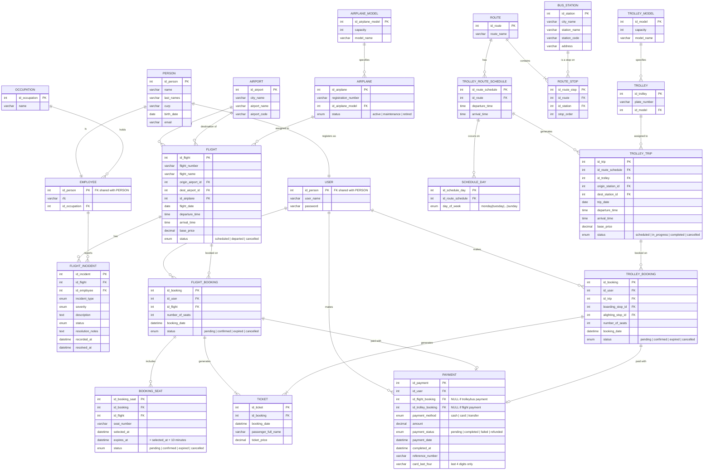

# ✈️ Flying With You

> Web-based reservation management system for a travel agency.  
> Allows users to register, search and book flights or tourist trolleybus trips, make simulated payments and download their ticket as a PDF — no installation required, directly from the browser.

---


---

## 📋 Table of Contents

- [About the project](#-about-the-project)
- [Key features](#-key-features)
- [Screenshots](#-screenshots)
- [Technologies used](#-technologies-used)
- [Prerequisites](#-prerequisites)
- [Installation and setup](#-installation-and-setup)
- [Project structure](#-project-structure)
- [System general flow](#-system-general-flow)
- [Reservation states](#-reservation-states)
- [Entity-Relationship Diagram](#️-entity-relationship-diagram)
- [Work methodology](#-work-methodology)
- [Product Backlog](#-product-backlog)
- [Testing](#-testing)
- [How to contribute](#-how-to-contribute)
- [Scope and limitations](#️-scope-and-limitations)
- [Development team](#-development-team)
- [License](#-license)

---

## 🛡️ Data Security Protocol (DML Operations)

To prevent accidental data loss, this project follows a strict transaction protocol when executing destructive statements (`DELETE` or `UPDATE`).

### Safe Deletion Workflow
Every deletion must be wrapped in a transaction to allow for manual verification before making changes permanent.

```sql
-- 1. Start the transaction context
BEGIN;

-- 2. Execute the filtered delete
-- ALWAYS use a WHERE clause with a Primary Key
DELETE FROM "USER" 
WHERE id_person = 5;

-- 3. Verification Step
-- Run a SELECT to ensure only the intended record was affected.
-- If the row count is incorrect or you made a mistake:
ROLLBACK;

-- 4. If everything is correct, commit the changes:
COMMIT;
```

---

## 📖 About the project

**Flying With You** is a web application developed for a travel agency that automates the tourist service reservation process. The system covers the complete cycle: from user registration to the issuance of a downloadable PDF payment receipt, reducing the agency's manual workload and improving the traveler's experience.

The system requires no additional software installation — it runs entirely in a modern Chromium-based browser and connects to Supabase as a cloud backend.

> 📌 Project developed exclusively for academic use at **CBTis 47 · April 2026**.  
> All prices in the system are denominated in **Mexican Pesos (MXN)**.

---

## ✨ Key features

### 🔐 Authentication
- New user registration (full name, email, password)
- Sign in and sign out via Supabase Auth
- Field validation with individual error messages per field
- Route protection: protected pages are not accessible without an active session

### ✈️ Flight reservation
- Flight search by origin, destination and date
- Visual seat map: 🟢 available · 🔴 occupied · 🔵 selected
- Color legend always visible next to the seat map
- Reservation created with `pending` status and a 10-minute countdown timer
- Automatic server-side cancellation if payment is not completed in time
- Prevention of duplicate reservations for the same flight and user

### 🚎 Tourist trolleybus reservation
- View available routes with name, description and departure point
- Book by route, date and boarding stop
- 10-minute timer with automatic cancellation and seat release

### 💳 Simulated payment
- Payment processing for reservations in `pending` status
- Status changes from `pending` to `confirmed` upon successful payment
- Payment automatically rejected if the timer has already expired
- Reservation stays in `pending` if a processing error occurs

### 🎫 PDF ticket generation
- Accumulate one or more confirmed reservations into a single ticket
- Only reservations with `confirmed` status can be added
- The PDF includes: passenger name, flight or route, seat number, date and price
- Single download per ticket — further attempts are permanently blocked, even from another device or session

---

## 📸 Screenshots

> 🚧 **Pending section** — Screenshots will be added once the system is complete.  
> The following views will be documented:

| View | Description |
|---|---|
| `login.png` | Login screen |
| `dashboard.png` | Main dashboard after login |
| `seat-map.png` | Visual seat map with color legend |
| `checkout.png` | Payment flow with active countdown timer |
| `ticket-pdf.png` | Generated and downloaded PDF ticket |

<!-- Once the system is ready, replace this section with:


-->

---

## 🛠️ Technologies used

| Component | Technology | Notes |
|---|---|---|
| Database | Supabase (PostgreSQL) | Tables, relationships and expiration logic |
| Authentication | Supabase Auth | Secure session and password management |
| Frontend | HTML5, CSS3, JavaScript | No additional frameworks |
| PDF generation | jsPDF | Loaded via CDN |
| Version control | Git / GitHub | One commit per member under their own account |

> ⚠️ The project **does not use backend frameworks or package managers** (npm, pip, etc.).  
> All external dependencies are loaded directly via CDN.

---

## 📋 Prerequisites

Before running the project, make sure you have the following:

- Updated Chromium-based browser: **Google Chrome** or **Microsoft Edge**
- Active account on [Supabase](https://supabase.com) with a project created
- The system SQL schema applied to that Supabase project
- Active internet connection (required for CDN and Supabase connection)

> ℹ️ No need to install Node.js, Python, or any other local runtime environment.

---

## 🚀 Installation and setup

### 1. Clone the repository

```bash
git clone https://github.com/daniellopezcabrera/cbtis47-db-turismo-2026.git
cd cbtis47-db-turismo-2026
```

### 2. Apply the database schema

Open the SQL editor of your Supabase project and run the `database/schema.sql` script from the repository. This will create all the necessary tables: `PERSON`, `USER`, `FLIGHT`, `BOOKING_SEAT`, `TICKET`, `PAYMENT`, among others.

### 3. Configure Supabase credentials

Open the `config/supabase.js` file and replace the values with those from your project:

```javascript
const SUPABASE_URL = "https://your-project.supabase.co";
const SUPABASE_KEY = "your-anon-public-key";

const supabaseClient = supabase.createClient(SUPABASE_URL, SUPABASE_KEY);
```

> 🔐 Use only the `anon key` (public key) from Supabase.  
> **Never push a service key (`service_role`) to the repository.**

### 4. Include CDN dependencies in your HTML files

Add these tags in the `<head>` of each HTML file that requires them:

```html
<!-- Supabase: database and authentication -->
<script src="https://cdn.jsdelivr.net/npm/@supabase/supabase-js@2"></script>

<!-- jsPDF: PDF ticket generation -->
<script src="https://cdnjs.cloudflare.com/ajax/libs/jspdf/2.5.1/jspdf.umd.min.js"></script>
```

### 5. Open the project in the browser

Open `index.html` directly in your browser, or use the **Live Server** extension for VS Code for a local server with automatic reload.

---

## 📁 Project structure

```
flygth-with-you/
│
├── index.html                  # Login / entry page
├── register.html               # New user registration
├── dashboard.html              # Main dashboard after login
│
├── flights/
│   ├── search.html             # Flight search
│   ├── seat-map.html           # Visual seat map
│   └── reservation.html        # Reservation confirmation and creation
│
├── trolleybus/
│   ├── routes.html             # Available routes listing
│   └── reservation.html        # Trolleybus reservation
│
├── payment/
│   └── checkout.html           # Simulated payment flow with timer
│
├── tickets/
│   └── download.html           # PDF ticket accumulation and single download
│
├── css/
│   └── styles.css              # Global system styles
│
├── js/
│   ├── auth.js                 # Module: registration, login, logout
│   ├── reservations.js         # Module: flights and trolleybus
│   ├── payment.js              # Module: payment processing
│   └── tickets.js              # Module: PDF generation
│
├── config/
│   └── supabase.js             # Supabase client initialization
│
└── database/
    └── schema.sql              # SQL script with all system tables
```

---

## 🔄 System general flow

```
┌──────────────────────────────────────────────┐
│            REGISTER / LOGIN                  │
└──────────────────┬───────────────────────────┘
                   │ Successful authentication
                   ▼
┌──────────────────────────────────────────────┐
│             MAIN DASHBOARD                   │
│        [Flights]     [Trolleybus]            │
└──────────┬───────────────────┬───────────────┘
           │                   │
           ▼                   ▼
    Flight search by     Available trolleybus
    origin/destination   routes
           │                   │
           ▼                   ▼
    Seat selection       Route, date and
    on visual map        boarding stop selection
           │                   │
           └─────────┬─────────┘
                     ▼
     ┌───────────────────────────────┐
     │      Reservation created      │
     │      Status: PENDING          │
     │      ⏱ Timer: 10 min         │
     └───────────────┬───────────────┘
                     │
        ┌────────────┴─────────────┐
        │                          │
        ▼                          ▼
 Payment completed         Timer expires
 within time limit         without payment
        │                          │
        ▼                          ▼
 Status: CONFIRMED         Status: EXPIRED
        │                  Seat released
        ▼                  User notified
 Ticket screen                    │
        │                          ▼
        ▼                   New search
 Add to ticket
        │
        ▼
 Generate and download PDF
 (one time only)
        │
        ▼
 Ticket marked as DOWNLOADED
 Button permanently blocked
```

---

## 🔁 Reservation states

The system handles four possible states for each reservation. Understanding this lifecycle is key for development:

| State | Description | Triggered by |
|---|---|---|
| `pending` | Reservation created. Seat blocked. Timer active. | System upon selection confirmation |
| `confirmed` | Payment successfully completed within the time limit. | System upon payment processing |
| `expired` | Timer reached zero without payment being completed. | Server-side via `expires_at` in DB |
| `cancelled` | Reservation manually cancelled or due to a system error. | System in case of failure |

> ⚙️ **Important:** The timer is managed **server-side** through the `selected_at` and `expires_at` fields in the `BOOKING_SEAT` table. The frontend only displays the visual countdown; the actual expiration logic lives in the database.

---

## 🗄️ Entity-Relationship Diagram



---

## 🏃 Work methodology

The project is developed under the **Scrum** methodology, with the following conventions:

- Development is organized into **fixed-duration Sprints**, each with a clear and achievable goal.
- Each Sprint begins with a **planning session** where the team selects User Stories from the Product Backlog.
- Each User Story follows the format: *As a [type of user], I want [action], so that [benefit]*.
- Acceptance criteria are written in **Gherkin** format (Given / When / Then).
- Each User Story has a **Story Points** value assigned before development.
- The Product Backlog is kept ordered by priority: **High / Medium / Low**.
- At the end of each Sprint a **Sprint Review** is held demonstrating the completed functionality.

### Version control rules

- All code is versioned with **Git** and hosted on **GitHub**.
- Each team member must make commits under **their own GitHub account**.
- Repositories with a single author are not accepted.
- Documentation (Technical Summary, Backlog, Requirements) must be kept up to date in the repository.

---

## 📦 Product Backlog

### 🎯 Product goal

> Allow users of a travel agency to independently register, search, book and pay for flights or trolleybus trips through a web application, receiving a downloadable PDF ticket as proof of their confirmed reservation.

### Epics

| ID | Epic | Priority |
|---|---|---|
| EP-01 | User authentication | High |
| EP-02 | Flight reservation | High |
| EP-03 | Tourist trolleybus reservation | High |
| EP-04 | Payment processing | High |
| EP-05 | PDF ticket generation | Medium |

### User Stories

| ID | User Story | Epic | Priority | Points |
|---|---|---|---|---|
| US-01 | User registration | EP-01 | High | 3 |
| US-02 | User login | EP-01 | High | 2 |
| US-03 | User logout | EP-01 | Medium | 1 |
| US-04 | Flight search | EP-02 | High | 5 |
| US-05 | Seat selection on visual map | EP-02 | High | 5 |
| US-06 | Flight reservation confirmation | EP-02 | High | 3 |
| US-07 | Explore trolleybus routes | EP-03 | High | 3 |
| US-08 | Trolleybus reservation | EP-03 | High | 5 |
| US-09 | Complete reservation payment | EP-04 | High | 5 |
| US-10 | Add reservations to ticket | EP-05 | Medium | 3 |
| US-11 | Download PDF ticket | EP-05 | Medium | 5 |
| **Total** | | | | **40 pts** |

---

## 🧪 Testing

This project does not include automated tests in version 1.0 — validations are performed **manually** following the complete system flow.

### Manual verification flow

To confirm the system is working correctly, run the following tests in order:

| # | Module | Action to verify | Expected result |
|---|---|---|---|
| 1 | Authentication | Register a new user | Redirect to dashboard without errors |
| 2 | Authentication | Log in with correct credentials | Active session, dashboard access |
| 3 | Authentication | Access a protected route without a session | Redirect to login |
| 4 | Flights | Search for a flight by origin, destination and date | List of available flights |
| 5 | Flights | Select an available seat | Seat marked in blue 🔵 |
| 6 | Reservation | Confirm a flight reservation | `pending` status, timer started |
| 7 | Payment | Complete payment within 10 minutes | Status changes to `confirmed` |
| 8 | Payment | Attempt to pay after the timer has expired | Payment rejected, `expired` status |
| 9 | Trolleybus | Book a trolleybus trip | `pending` status, timer started |
| 10 | Ticket | Add a confirmed reservation to the ticket | Reservation appears in the summary |
| 11 | Ticket | Download the PDF ticket | PDF generated and downloaded correctly |
| 12 | Ticket | Attempt to download the same ticket again | Button permanently blocked |

> 🔮 Automated tests (unit or integration) are considered a future improvement for later versions of the system.

---

## 🤝 How to contribute

This is an academic team project. Follow these rules to keep the history clean and meet the project requirements.

### Git workflow

**1. Always work on your own branch**
```bash
# Name your branch with your name or the feature you are developing
git checkout -b feature/feature-name

# Example:
git checkout -b feature/daniel-seat-map
```

**2. Make small, descriptive commits**
```bash
git add .
git commit -m "feat: add visual seat map with status colors"
```

**3. Push your branch and open a Pull Request to `main`**
```bash
git push origin feature/daniel-seat-map
# Then open a Pull Request on GitHub
```

### Commit convention

| Prefix | When to use it |
|---|---|
| `feat:` | New feature |
| `fix:` | Bug fix |
| `style:` | CSS or UI changes without logic |
| `refactor:` | Code restructuring without changing behavior |
| `docs:` | Documentation changes |
| `db:` | SQL schema or query changes |

> ⚠️ **Mandatory rule (AG-09):** Each team member must make commits from their own GitHub account. Repositories with a single author are not acceptable.

---

## ⚠️ Scope and limitations (v1.0)

### Within scope
- User registration and login
- Simulated reservation and payment for flights and trolleybus
- Single PDF ticket download per confirmed reservation

### Out of scope (v1.0)
- Integration with a real payment gateway — payment is completely simulated
- Native mobile application
- Advanced administrative panel for the agency
- Email notifications
- Real-time seat map synchronization between simultaneous sessions

### Technical restrictions
- Compatible only with **Chromium** browsers (Chrome, Edge) — Firefox and Safari are not guaranteed
- Designed and tested for **desktop** — mobile support is out of scope in v1.0
- Flights or trolleybuses cannot be registered with **past dates or times**
- If two users open the same flight simultaneously, a seat may appear available to both until one confirms it first — there is no real-time synchronization

---

## 👥 Development team

| Name | Role | GitHub |
|---|---|---|
| López Cabrera Daniel | Analyst and Designer | [@Daniellopezcabrera](https://github.com/Daniellopezcabrera) |
| García Sánchez German | SQL Developer | [@garciasanchezgermanm3s1-maker](https://github.com/garciasanchezgermanm3s1-maker) |
| Cueto Madrigal Michelle | Query Master | [@michellecuetomadrigal](https://github.com/michellecuetomadrigal) |
| Cruz Estrada Johana Elena | SQL Tester | [@cruzestradajohanaelenam351-collab](https://github.com/cruzestradajohanaelenam351-collab) |
| Roldan Barrera Edson Yalan | DBA (Database Administrator) | [@roldan-barrera-edson-yalan-m3s1-wq](https://github.com/roldan-barrera-edson-yalan-m3s1-wq) |

---

## 📄 License

This project was developed exclusively for academic purposes as part of the curriculum of **CBTis 47 (Centro de Bachillerato Tecnológico industrial y de servicios No. 47)**.

**Not permitted:**
- Using this system in a real production environment
- Redistributing it for commercial purposes
- Publishing it as your own work without crediting the original team

© 2026 Flying With You — CBTis 47. All rights reserved.

---

*Flying With You — CBTis 47 · April 2026*
