# DB Administration: Security
## Flygth With You — CBTis 47 · 2026

**DBA:** Roldan Barrera Edson Yalan  
**SQL File:** `src/03_users_security.sql`  
**Database Engine:** PostgreSQL (Supabase)  

---

## 1. Introduction

This document describes the security decisions applied to the **Flygth With You** database — a web-based tourism agency system that manages flight reservations and trolleybus trips.

Database security was implemented at three levels:

1. **Roles** — reusable permission templates assigned by user type
2. **GRANT / REVOKE** — granting and revoking specific privileges
3. **RLS (Row Level Security)** — controlling which rows each user can see

---

## 2. Least Privilege Principle

> *"As a DBA, why should I not give ALL PRIVILEGES to the web application?"*

The **Least Privilege Principle** states that every user or process must have access only to the resources it needs to perform its function — nothing more.

In Flygth With You this is critical because the database contains:

- Passengers' personal data (CURP, date of birth, email)
- Payment information (method, last four digits of card)
- Hashed employee credentials

If the web application had `ALL PRIVILEGES` and an attacker compromised it, they could delete all reservations, modify flight prices, or eliminate users. By limiting permissions, the potential damage is kept to a minimum.

---

## 3. Roles Created

A **role** in PostgreSQL works as a template: it is defined once with its permissions and then assigned to the users who need it. If a permission needs to change, only the role is modified and all assigned users are updated automatically.

| Role | Associated Occupation | Purpose |
|---|---|---|
| `rol_pasajero` | Passenger / end user | Search and book flights and trolleybus routes |
| `rol_tripulacion_vuelo` | Pilot / Co-pilot | View assigned flights and passenger manifest |
| `rol_asistente_vuelo` | Flight attendant | View passengers and record in-flight incidents |
| `rol_chofer` | Driver | View daily trips and update trip status |
| `rol_administrador` | Administrator | Full system management |

```sql
CREATE ROLE rol_pasajero;
CREATE ROLE rol_tripulacion_vuelo;
CREATE ROLE rol_asistente_vuelo;
CREATE ROLE rol_chofer;
CREATE ROLE rol_administrador;
```

### Verification — Roles registered in the database

The following query confirms that all five roles were successfully created in PostgreSQL:

```sql
SELECT rolname FROM pg_roles
WHERE rolname LIKE 'rol_%';
```

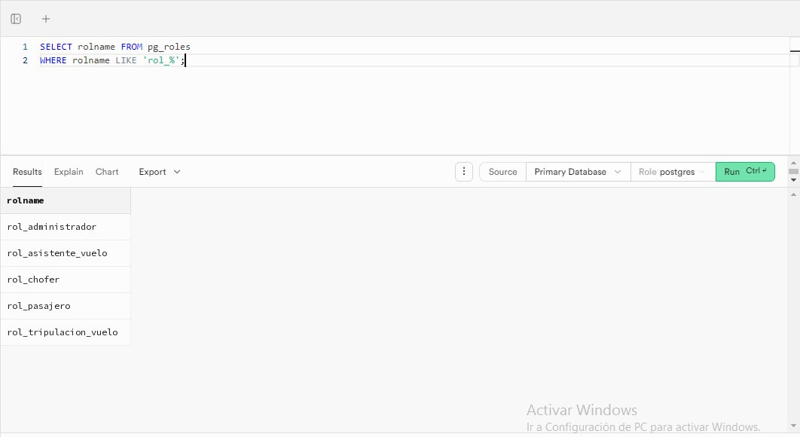

---

## 4. Permissions Assigned with GRANT

### General Syntax

```sql
GRANT [permission] ON [table] TO [role_or_user];
```

### 4.1 Passenger role

The passenger can view available flights and routes, create their own reservations, and register payments.

```sql
GRANT SELECT ON flight, airport, airplane, airplane_model TO rol_pasajero;
GRANT SELECT ON route, route_stop, bus_station TO rol_pasajero;
GRANT SELECT ON trolley_trip, trolley_route_schedule, schedule_day TO rol_pasajero;
GRANT SELECT, INSERT ON flight_booking, booking_seat TO rol_pasajero;
GRANT SELECT, INSERT ON trolley_booking TO rol_pasajero;
GRANT SELECT, INSERT ON payment TO rol_pasajero;
GRANT SELECT, INSERT, UPDATE ON ticket TO rol_pasajero;
GRANT SELECT, UPDATE ON person TO rol_pasajero;
```

What they **cannot** do: create flights, modify prices, view other users' reservations, or delete records.

### 4.2 Flight crew role (pilot and co-pilot)

Can view the flights assigned to their profile. The pilot can also update flight status (`scheduled → departed → cancelled`).

```sql
GRANT SELECT ON flight, airport, airplane, airplane_model TO rol_tripulacion_vuelo;
GRANT SELECT ON flight_booking, booking_seat TO rol_tripulacion_vuelo;
GRANT SELECT ON person TO rol_tripulacion_vuelo;
GRANT UPDATE (status) ON flight TO rol_tripulacion_vuelo;
```

> The `UPDATE` is limited **only to the `status` column**, not the entire table. This prevents a pilot from modifying prices or routes.

### 4.3 Flight attendant role

Views the passenger list and seat assignments for their flight. Can record incidents that occur on board.

```sql
GRANT SELECT ON flight, flight_booking, booking_seat TO rol_asistente_vuelo;
GRANT SELECT ON person TO rol_asistente_vuelo;
GRANT SELECT, INSERT ON incident TO rol_asistente_vuelo;
```

### 4.4 Driver role

Views their daily trips with the passenger list and boarding stops. Can update the trip status.

```sql
GRANT SELECT ON trolley_trip, trolley_route_schedule, route, route_stop TO rol_chofer;
GRANT SELECT ON bus_station, trolley_booking TO rol_chofer;
GRANT SELECT ON person TO rol_chofer;
GRANT UPDATE (status) ON trolley_trip TO rol_chofer;
```

### 4.5 Administrator role

Full access. This role is only assigned to the DBA and the system `admin` user.

```sql
GRANT SELECT, INSERT, UPDATE, DELETE ON ALL TABLES IN SCHEMA public TO rol_administrador;
```

---

## 5. Database Users Created

These database users correspond to the profiles already registered in the system's `users` table.

| DB User | Person (id_person) | Assigned Role |
|---|---|---|
| `db_admin` | Admin Flygth (18) | `rol_administrador` |
| `db_roberto_piloto` | Roberto Mendoza Ruiz (32) | `rol_tripulacion_vuelo` |
| `db_sandra_copil` | Sandra López Vega (33) | `rol_tripulacion_vuelo` |
| `db_miguel_sobre` | Miguel Torres Castillo (34) | `rol_asistente_vuelo` |
| `db_elena_sobre` | Elena Ramírez Díaz (35) | `rol_asistente_vuelo` |
| `db_jorge_chofer` | Jorge Hernández Mora (36) | `rol_chofer` |
| `db_patricia_chofer` | Patricia Sánchez Luna (37) | `rol_chofer` |
| `db_app_web` | *(application user)* | SELECT only on public tables |

### Creation and assignment example

```sql
CREATE USER db_roberto_piloto WITH PASSWORD 'Piloto$Flygth32';
GRANT rol_tripulacion_vuelo TO db_roberto_piloto;
```

### New user: db_app_web

This user represents the connection the web application uses to display available flights and routes to unauthenticated visitors. It demonstrates the least privilege principle: the web app **does not need to modify data**, only read it.

```sql
CREATE USER db_app_web WITH PASSWORD 'AppWeb$Flygth2026';
GRANT SELECT ON flight, airport, route, bus_station, trolley_trip TO db_app_web;
```

If an attacker compromised this user, the most they could do is read public flight data — they could not delete reservations or access personal data.

---

## 6. Revoking Permissions with REVOKE

`REVOKE` removes a permission that was previously granted. The syntax is identical to `GRANT` but uses `FROM` instead of `TO`.

```sql
-- General syntax:
REVOKE [permission] ON [table] FROM [role_or_user];
```

### Cases applied in the project

**Case 1:** A co-pilot was detected updating flight status without authorization. The UPDATE permission is removed from the entire role while the situation is investigated.

```sql
REVOKE UPDATE (status) ON flight FROM rol_tripulacion_vuelo;
```

**Case 2:** The web application no longer needs to display trolleybus routes on the public page.

```sql
REVOKE SELECT ON trolley_trip FROM db_app_web;
```

**Case 3:** After the investigation, it is confirmed that only the pilot (not the co-pilot) should be able to update flights. The permission is granted directly to the pilot's user.

```sql
GRANT UPDATE (status) ON flight TO db_roberto_piloto;
```

---

## 7. Row Level Security (RLS)

RLS is an additional security layer exclusive to PostgreSQL that was already active in the project (visible in Supabase with the "RLS policies" indicator).

### Difference between GRANT and RLS

| | GRANT / REVOKE | RLS |
|---|---|---|
| Controls | Which tables a user can access | Which rows within the table they can see |
| Example | Passenger can SELECT on `flight_booking` | Passenger only sees THEIR reservations, not others' |

### Policies applied

```sql
ALTER TABLE flight_booking ENABLE ROW LEVEL SECURITY;
ALTER TABLE trolley_booking ENABLE ROW LEVEL SECURITY;

-- Each passenger only sees their own flight reservations
CREATE POLICY pasajero_ve_sus_reservaciones_vuelo
ON flight_booking FOR SELECT
USING (id_user = current_setting('app.current_user_id')::int);

-- Administrator can see all reservations
CREATE POLICY admin_ve_todo_flight_booking
ON flight_booking FOR ALL
TO rol_administrador
USING (true);
```

---

## 8. Permission Verification — Administrator Role

In Supabase, permissions granted to custom roles via `GRANT ALL TABLES` are visible through `information_schema.role_table_grants`. The following screenshots show the verified permissions for `rol_administrador` across all system tables.

```sql
SELECT table_name, privilege_type
FROM information_schema.role_table_grants
WHERE table_schema = 'public' AND grantee = 'rol_administrador'
ORDER BY table_name;
```

> **Note:** In Supabase, permissions granted to custom roles with granular GRANT statements (as used for `rol_pasajero`, `rol_chofer`, etc.) are managed internally and may not always appear in `information_schema`. The roles themselves are confirmed to exist via `pg_roles` (see Section 3).

### airplane & airplane_model
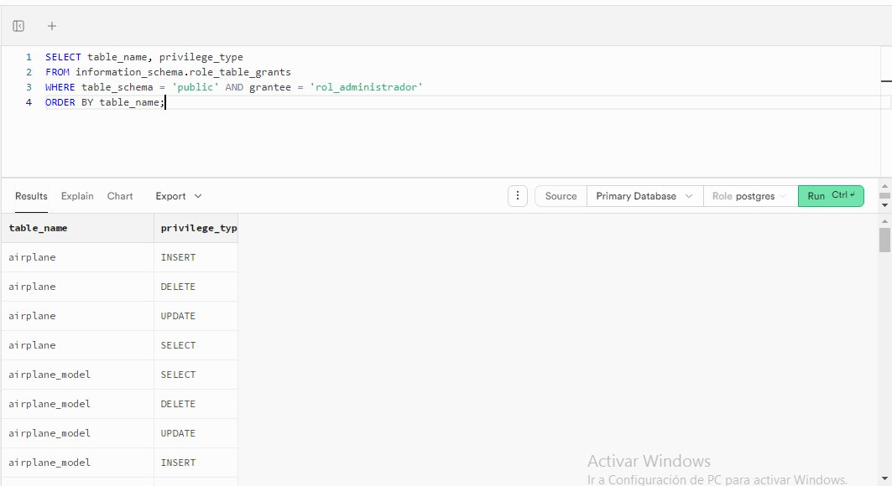

### airport
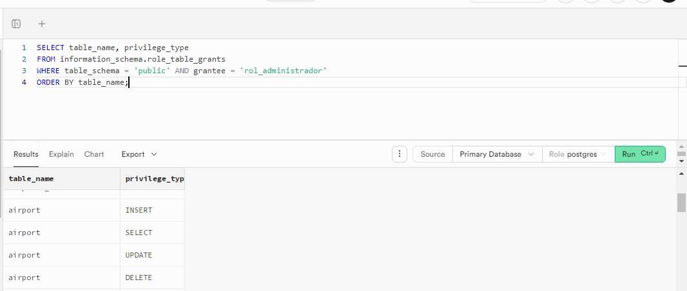

### booking_seat
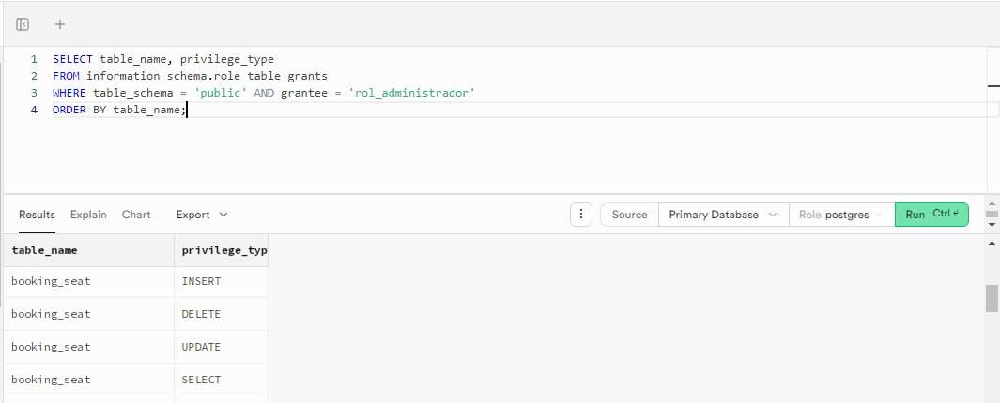

### bus_station
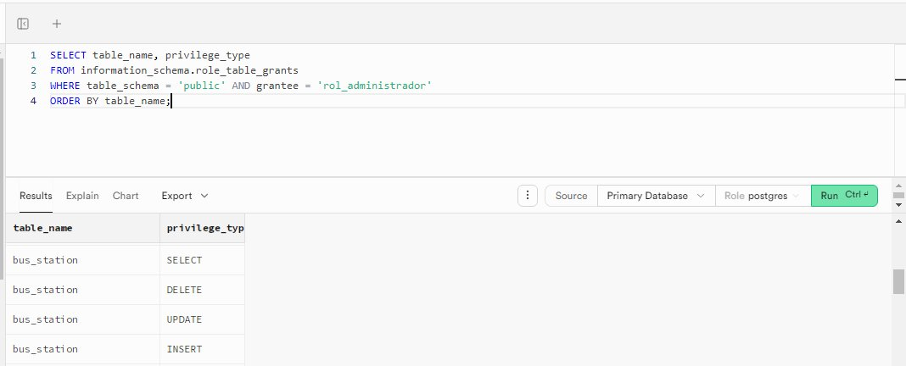

### employee
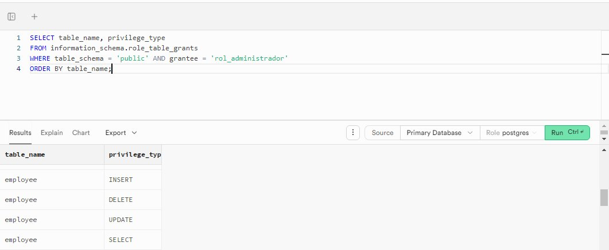

### flight
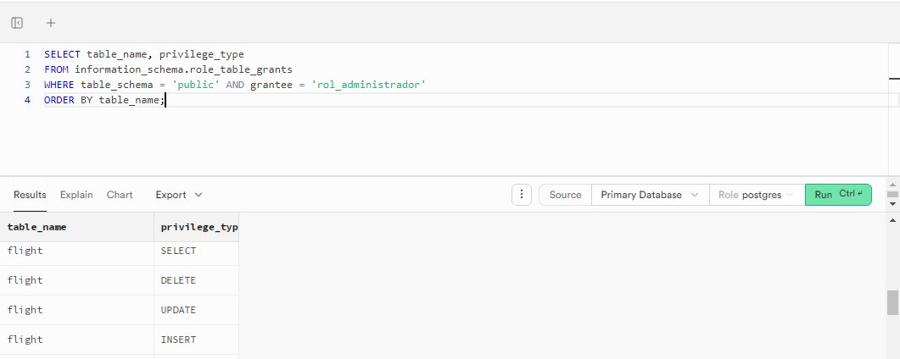

### flight_booking
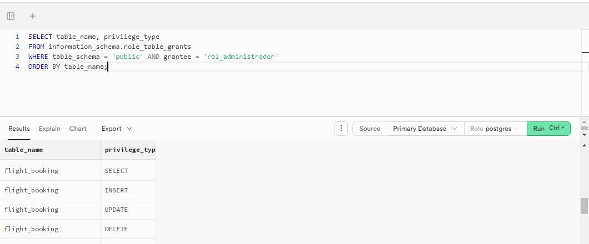

### flight_incident
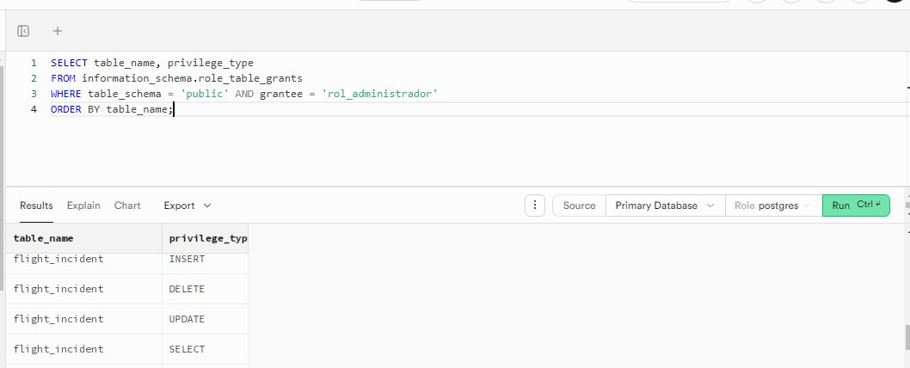

### incident
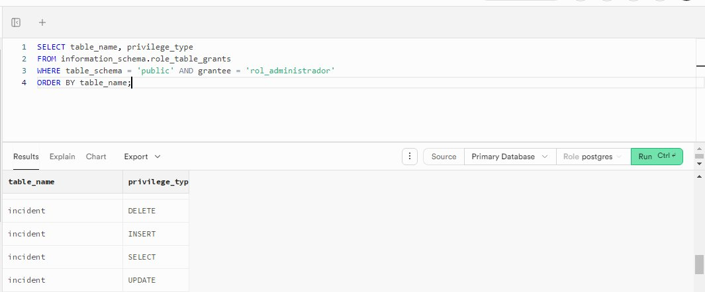

### occupation
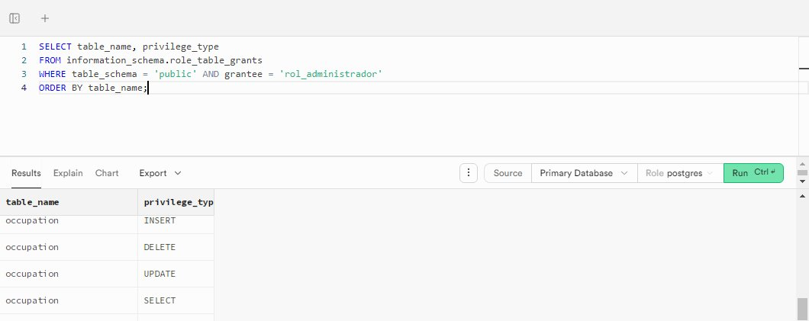

### payment
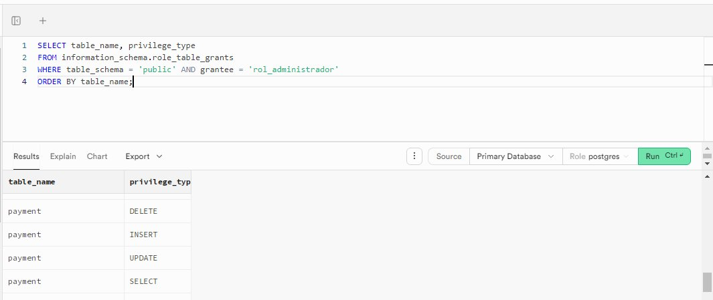

### person
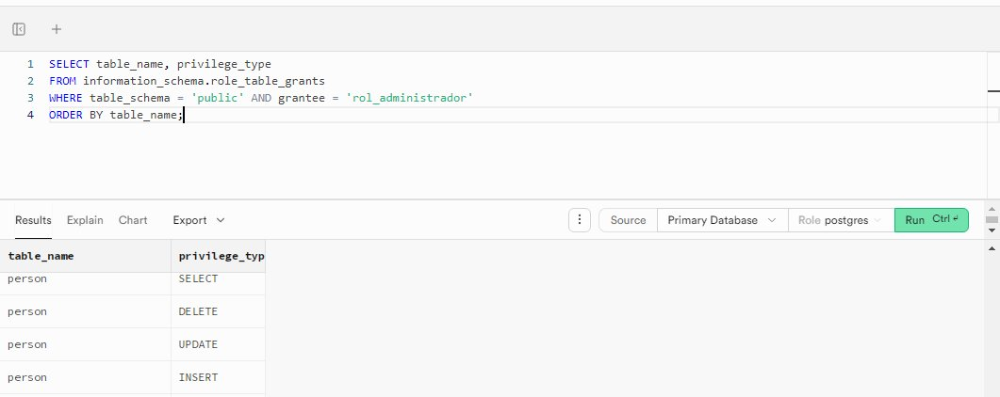

### route
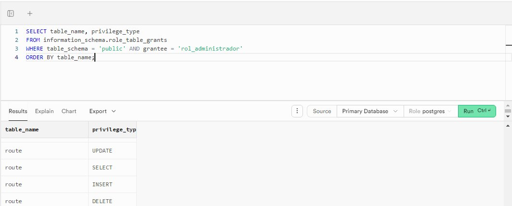

### route_stop
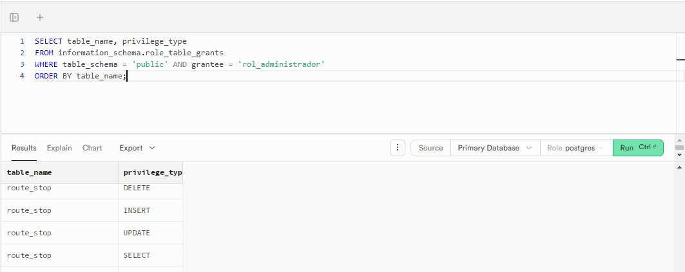

### schedule_day
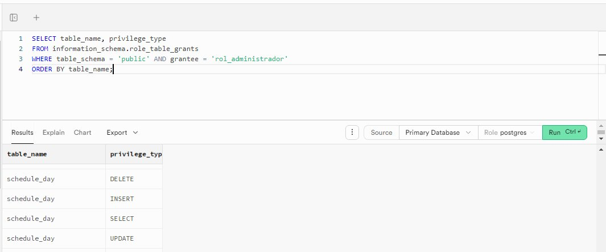

### ticket
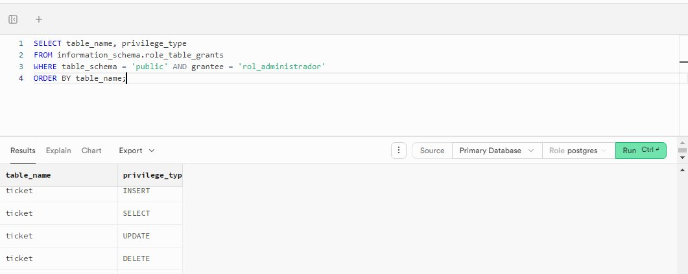

### trolley
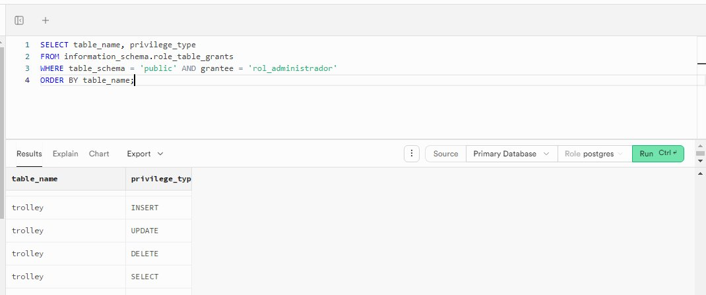

### trolley_booking
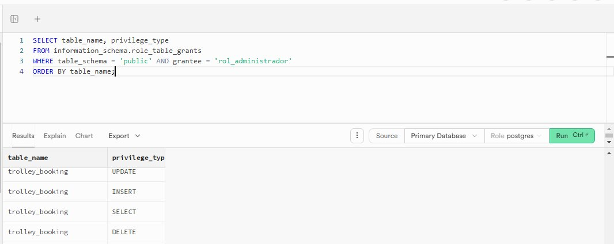

### trolley_model
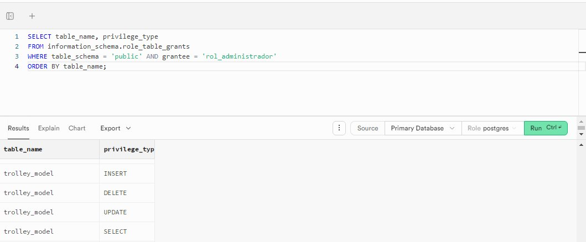

### trolley_route_schedule
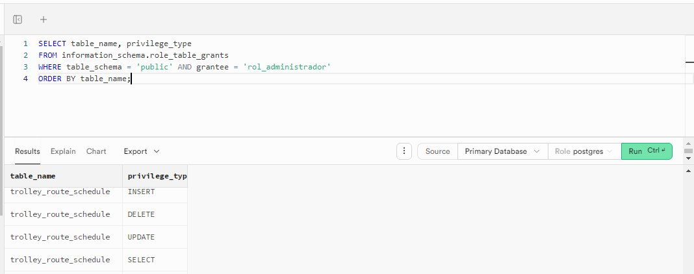

### trolley_trip
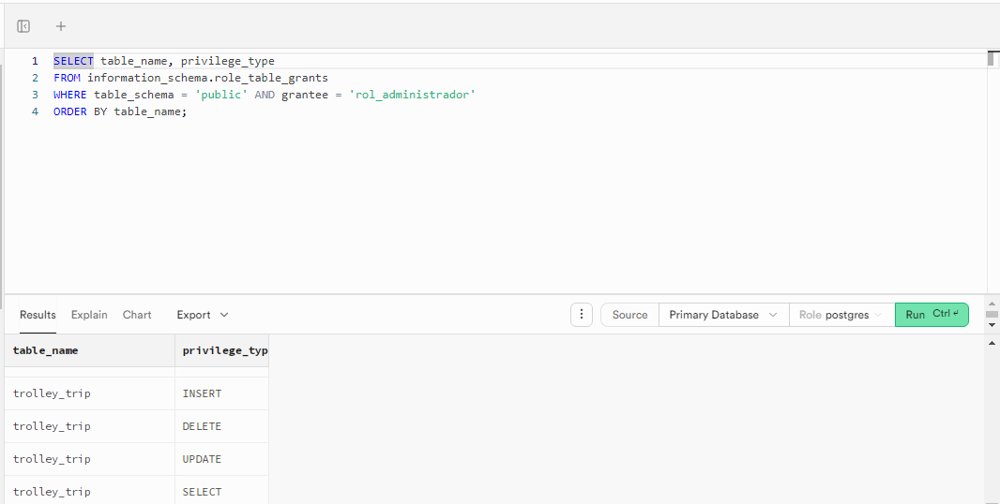

### users
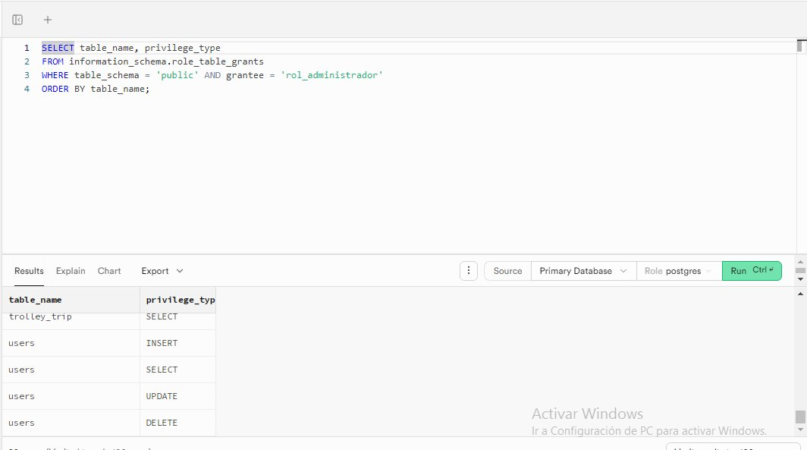

---

## 9. Security Decision Summary

| Decision | Justification |
|---|---|
| Roles separated by occupation | Changing permissions for one occupation automatically updates all its users |
| UPDATE limited to `status` column only | The pilot cannot modify prices or routes, only the operational status |
| `db_app_web` user with SELECT only | If the web app is compromised, data cannot be modified or deleted |
| RLS active on reservation tables | A passenger cannot see other users' reservations even with SELECT |
| No ALL PRIVILEGES for the web app | Limits the maximum possible damage in case of an attack or vulnerability |
