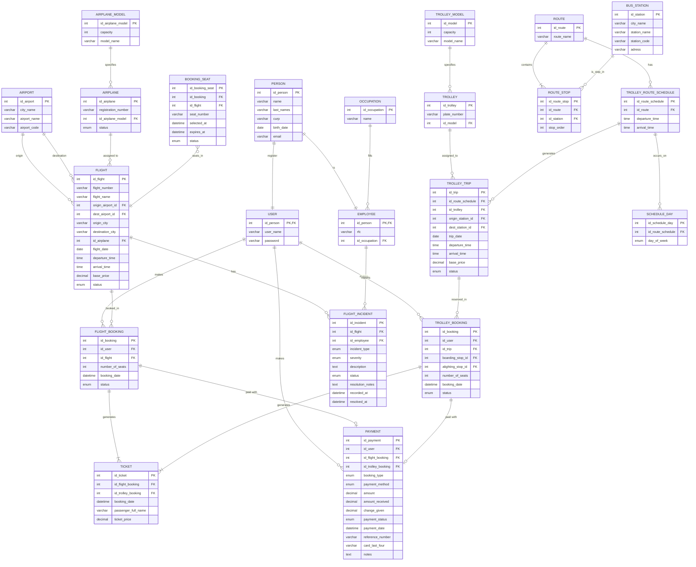

# Technical Manual — Flying With You

**Project:**  Hybrid Transportation System

**Institution:** CBTis 47

**Course:** Relational Database

**Version:** 1.0.0

**Date:** February-June 2026

## Table of Contents
1. [Project Overview](#1-project-overview)
2. [Entity-Relationship Diagram](#2-entity-relationship-diagram)

## 1. Project Overview

**Flying With You** is a web-based reservation management system developed for 
a travel agency as part of the academic curriculum of CBTis 47. The system 
automates the complete tourist service reservation cycle — from user 
registration to the issuance of a downloadable PDF payment receipt — reducing 
manual workload and improving the traveler's experience.

Although the project is titled *Flying With You*, the system scope extends 
beyond air travel. The database manages two distinct transportation modes: 
**commercial flights** between airports, and **tourist trolleybus trips** along 
predefined routes with scheduled stops.

### System Scope

The database supports the following functional domains:

- **User management:** registration, authentication, and role separation 
  between end users and internal employees.
- **Flight operations:** airports, airplane models, aircraft assignments, 
  scheduled flights, and incident reporting.
- **Trolleybus operations:** routes, bus stations, stop ordering, abstract 
  route schedules, and concrete trip instances.
- **Reservation lifecycle:** seat selection with a 10-minute expiration window, 
  status transitions (`pending → confirmed → expired / cancelled`), and 
  duplicate prevention.
- **Payment processing:** support for cash, card, and bank transfer, with 
  fields for refund tracking and card security.
- **Ticket generation:** accumulation of confirmed reservations into a single 
  downloadable PDF, restricted to one download per ticket.

### Technical Stack

| Layer | Technology |
|---|---|
| Database | Supabase (PostgreSQL) |
| Authentication | Supabase Auth |
| Frontend | HTML5, CSS3, Vanilla JavaScript |
| PDF generation | jsPDF (via CDN) |
| Version control | Git / GitHub |

> All monetary values in the system are denominated in **Mexican Pesos (MXN)**.  
> This project was developed exclusively for academic use and is not intended 
> for production deployment.

### Design Principles

The database schema was designed following **Third Normal Form (3NF)** with a 
strict separation-of-concerns approach. Key architectural decisions include:

- Splitting flight and trolleybus bookings into independent tables 
  (`FLIGHT_BOOKING`, `TROLLEY_BOOKING`) to avoid polymorphic ambiguity.
- Separating abstract scheduling (`TROLLEY_ROUTE_SCHEDULE`) from concrete trip 
  instances (`TROLLEY_TRIP`) to support recurring routes without data 
  duplication.
- Using surrogate primary keys (`AUTO_INCREMENT`) across all entities for 
  referential integrity.
- Enforcing reservation expiration logic server-side through `expires_at` 
  timestamps, with the frontend limited to visual countdown display only.

## 2. Entity-Relationship Diagram

The following diagram represents the complete database schema for the 
**Flying With You** system. The schema is organized into six logical sections, 
each corresponding to a functional domain of the application.

---

### 2.1 People and Accounts

The system distinguishes between two types of actors derived from `PERSON`:

- **`USER`** represents registered customers who can search, book, and pay 
  for services. It shares its primary key with `PERSON` (`id_person`), 
  implementing a one-to-one identifying relationship rather than a foreign key 
  — this enforces that a user cannot exist without a person record.
- **`EMPLOYEE`** follows the same pattern: it shares `id_person` with `PERSON` 
  and holds an `id_occupation` foreign key referencing the `OCCUPATION` table. 
  This design avoids storing employee-specific fields in the general `PERSON` 
  table, keeping it normalized.

---

### 2.2 Airports and Flights

The flight subsystem is built around four core entities:

- **`AIRPORT`** stores origin and destination locations. `FLIGHT` references 
  `AIRPORT` twice (`origin_airport_id`, `dest_airport_id`), which represents 
  a self-referencing pattern on the same table via two distinct foreign keys.
- **`AIRPLANE_MODEL`** defines the aircraft type and capacity. **`AIRPLANE`** 
  represents a specific physical unit assigned to a model, with an operational 
  `status` enum (`active | maintenance | retired`).
- **`FLIGHT`** is the central entity of this subsystem. It ties together the 
  origin airport, destination airport, and assigned airplane into a scheduled 
  service with a base price and status lifecycle.
- **`FLIGHT_INCIDENT`** allows employees to log operational incidents against 
  a specific flight, with severity classification and resolution tracking.

---

### 2.3 Flight Reservations

The reservation flow for flights involves three entities:

- **`FLIGHT_BOOKING`** records the user's intent to reserve seats on a flight. 
  Its `status` field (`pending | confirmed | expired | cancelled`) drives the 
  entire reservation lifecycle.
- **`BOOKING_SEAT`** represents each individual seat within a booking. It holds 
  the expiration logic: `expires_at = selected_at + 10 minutes`. The 
  expiration is enforced server-side — the frontend only renders the countdown.
- The separation between `FLIGHT_BOOKING` and `BOOKING_SEAT` allows a single 
  booking to contain multiple seats while tracking each seat's status 
  independently.

---

### 2.4 Trolleybus System

The trolleybus subsystem mirrors the flight subsystem in structure but adds a 
scheduling layer to support recurring routes:

- **`ROUTE`** and **`ROUTE_STOP`** define the abstract path a trolleybus 
  follows. `ROUTE_STOP` introduces a `stop_order` field that determines the 
  physical sequence of stations along a route.
- **`BUS_STATION`** consolidates all stop locations. This avoids a separate 
  `TROLLEY_STOP` table and keeps location data centralized.
- **`TROLLEY_ROUTE_SCHEDULE`** represents an abstract recurring schedule 
  (departure and arrival times for a route). **`SCHEDULE_DAY`** normalizes the 
  days of operation as individual rows with a `day_of_week` enum, avoiding 
  multi-valued columns.
- **`TROLLEY_TRIP`** is the concrete instantiation of a schedule on a specific 
  date, with a specific trolleybus assigned. This two-layer design 
  (abstract schedule → concrete trip) prevents data duplication for routes 
  that operate multiple days per week.

---

### 2.5 Trolleybus Reservations

- **`TROLLEY_BOOKING`** functions equivalently to `FLIGHT_BOOKING` but for 
  trips. It includes `boarding_stop_id` and `alighting_stop_id` as foreign 
  keys to `ROUTE_STOP`, allowing partial-route boarding rather than requiring 
  users to travel the full route.

---

### 2.6 Tickets and Payments

- **`TICKET`** is generated from either a `FLIGHT_BOOKING` or a 
  `TROLLEY_BOOKING`. It holds `id_flight_booking` and `id_trolley_booking` 
  as nullable foreign keys — only one will be populated per record, determined 
  by the booking type. This avoids a separate ticket table per transportation 
  mode.
- **`PAYMENT`** supports three payment methods (`cash | card | transfer`). 
  For cash transactions, `amount_received` and `change_given` capture the 
  physical exchange. For card payments, only `card_last_four` is stored — 
  never the full card number — as a security measure. The `booking_type` enum 
  clarifies which foreign key is active (`id_flight_booking` or 
  `id_trolley_booking`).
