# Technical Summary — Flygth With You
**Version:** 1.0 | **Date:** April 2026 | **Status:** Draft

---

## 1. General Description

**Flygth With You** is a web-based reservation management system for a tourism agency. It allows users to register, log in, search and book flights or tourist trolleybus trips, process payments, and download their ticket as a PDF for printing.

---

## 2. System Objective

To develop a functional web application that automates the process of booking tourism services, from user registration to the issuance of a payment receipt, ensuring a simple and accessible experience.

---

## 3. Technologies Used

| Component | Technology |
|---|---|
| Database and authentication | Supabase (PostgreSQL) |
| Frontend | HTML5, CSS3, JavaScript |
| PDF generation | JS library (e.g. jsPDF) |
| Version control | GitHub |

---

## 4. Product Backlog

### 🎯 Product Goal

> Enable users of a tourism agency to independently register, search, book, and pay for flights or tourist trolleybus trips through a web application, receiving a downloadable PDF ticket as proof of their confirmed reservation — reducing manual workload for the agency and improving the end-to-end experience for travelers.

---

### 📦 Epics

| ID | Epic Name | Priority |
|---|---|---|
| EP-01 | User Authentication | High |
| EP-02 | Flight Reservation | High |
| EP-03 | Tourist Trolleybus Reservation | High |
| EP-04 | Payment Processing | High |
| EP-05 | PDF Ticket Generation | Medium |

---

### EP-01 · User Authentication

#### US-01 — User Registration

**As a** new visitor,
**I want to** create an account with my personal data and credentials,
**So that** I can access the reservation system securely.

**Priority:** High | **Story Points:** 3

##### Acceptance Criteria

```gherkin
Feature: User Registration

  Scenario: Successful registration with valid data
    Given the user is on the registration page
    When the user enters a valid name, email, and password
    And the user submits the registration form
    Then the system creates a new account via Supabase Auth
    And the user is redirected to the login page
    And a confirmation message is displayed

  Scenario: Registration fails with an existing email
    Given the user is on the registration page
    When the user enters an email that is already registered
    And the user submits the registration form
    Then the system displays an error message indicating the email is already in use
    And no new account is created

  Scenario: Registration fails with incomplete fields
    Given the user is on the registration page
    When the user leaves one or more required fields empty
    And the user submits the registration form
    Then the system highlights the empty fields
    And displays a validation message for each missing field
```

---

#### US-02 — User Login

**As a** registered user,
**I want to** log in with my email and password,
**So that** I can access my account and manage my reservations.

**Priority:** High | **Story Points:** 2

##### Acceptance Criteria

```gherkin
Feature: User Login

  Scenario: Successful login with valid credentials
    Given the user is on the login page
    When the user enters a registered email and correct password
    And the user clicks the login button
    Then the system authenticates the user through Supabase Auth
    And the user is redirected to the home dashboard

  Scenario: Login fails with incorrect credentials
    Given the user is on the login page
    When the user enters an incorrect email or password
    And the user clicks the login button
    Then the system displays an authentication error message
    And the user remains on the login page

  Scenario: Login fails with empty fields
    Given the user is on the login page
    When the user submits the form with one or more empty fields
    Then the system displays a validation message
    And does not attempt authentication
```

---

#### US-03 — User Logout

**As a** logged-in user,
**I want to** log out of my session,
**So that** my account remains secure when I finish using the system.

**Priority:** Medium | **Story Points:** 1

##### Acceptance Criteria

```gherkin
Feature: User Logout

  Scenario: Successful logout
    Given the user is logged in and on any page of the application
    When the user clicks the logout button
    Then the system ends the active session
    And the user is redirected to the login page
    And the user cannot navigate to protected pages without logging in again
```

---

### EP-02 · Flight Reservation

#### US-04 — Flight Search

**As a** logged-in user,
**I want to** search for available flights by origin, destination, and date,
**So that** I can find the flight that best fits my travel plans.

**Priority:** High | **Story Points:** 5

##### Acceptance Criteria

```gherkin
Feature: Flight Search

  Scenario: Successful search with matching results
    Given the user is on the flight search page
    When the user selects an origin, a destination, and a valid travel date
    And the user clicks the search button
    Then the system queries the database for matching flights
    And displays a list of available flights with schedule and pricing details

  Scenario: Search returns no results
    Given the user is on the flight search page
    When the user selects a combination with no available flights
    And the user clicks the search button
    Then the system displays a message indicating no flights were found
    And suggests the user try a different date or route

  Scenario: Search submitted with incomplete filters
    Given the user is on the flight search page
    When the user submits the search form without filling in all required filters
    Then the system highlights the missing fields
    And does not execute the query
```

---

#### US-05 — Seat Selection for Flights

**As a** logged-in user,
**I want to** view the seat map of a selected flight and choose an available seat,
**So that** I can secure the specific seat I prefer before proceeding to payment.

**Priority:** High | **Story Points:** 5

##### Acceptance Criteria

```gherkin
Feature: Flight Seat Selection

  Scenario: Viewing the seat map
    Given the user has selected a flight from the search results
    When the seat selection screen loads
    Then the system displays a visual seat map
    And available seats are shown in green
    And occupied or reserved seats are shown in red

  Scenario: Selecting an available seat
    Given the user is viewing the seat map
    When the user clicks on a green (available) seat
    Then the seat is marked as selected
    And the seat number and label (e.g., "12A") are displayed in the reservation summary

  Scenario: Attempting to select an occupied seat
    Given the user is viewing the seat map
    When the user clicks on a red (occupied) seat
    Then the system does not allow the selection
    And displays a message indicating the seat is unavailable
```

---

#### US-06 — Flight Reservation Confirmation

**As a** logged-in user,
**I want to** confirm my seat selection and create a reservation with pending status,
**So that** my seat is held while I complete the payment process.

**Priority:** High | **Story Points:** 3

##### Acceptance Criteria

```gherkin
Feature: Flight Reservation Creation

  Scenario: Reservation created with pending status
    Given the user has selected a seat on a flight
    When the user confirms the selection
    Then the system creates a reservation record in the database with status "pending"
    And the seat is marked as temporarily occupied
    And a 10-minute payment countdown timer starts and is displayed to the user

  Scenario: Reservation expires before payment
    Given the user has a pending reservation and the 10-minute timer is active
    When the countdown reaches zero without payment being completed
    Then the system automatically cancels the reservation
    And the seat is released and shown as available again
    And the user receives a notification that the reservation has expired

  Scenario: Duplicate reservation attempt
    Given the user already has an active pending reservation for the same flight
    When the user attempts to make another reservation on the same flight
    Then the system displays a message indicating an active reservation already exists
    And does not create a duplicate record
```

---

### EP-03 · Tourist Trolleybus Reservation

#### US-07 — Browse Trolleybus Routes

**As a** logged-in user,
**I want to** browse available tourist trolleybus routes,
**So that** I can choose the route that interests me before making a reservation.

**Priority:** High | **Story Points:** 3

##### Acceptance Criteria

```gherkin
Feature: Trolleybus Route Browsing

  Scenario: Displaying available routes
    Given the user is on the trolleybus section of the application
    When the page loads
    Then the system retrieves and displays all available trolleybus routes
    And each route shows its name, description, and departure location

  Scenario: No routes available
    Given the user is on the trolleybus section
    When the system finds no routes in the database
    Then a message is displayed informing the user that no routes are currently available
```

---

#### US-08 — Trolleybus Reservation

**As a** logged-in user,
**I want to** select a trolleybus route, a date, and a pickup location to create a reservation,
**So that** I can secure my spot on the tour before proceeding to payment.

**Priority:** High | **Story Points:** 5

##### Acceptance Criteria

```gherkin
Feature: Trolleybus Reservation

  Scenario: Successful reservation creation
    Given the user has selected a trolleybus route
    When the user chooses a valid date and a pickup location
    And the user confirms the reservation
    Then the system creates a reservation record with status "pending"
    And a 10-minute payment countdown timer starts and is displayed to the user

  Scenario: Reservation attempt with no availability on selected date
    Given the user has selected a route
    When the user chooses a date with no available slots
    Then the system displays a message indicating no availability for that date
    And the user is prompted to choose a different date

  Scenario: Reservation expires before payment
    Given the user has a pending trolleybus reservation with the 10-minute timer active
    When the countdown reaches zero without payment being completed
    Then the system automatically cancels the reservation
    And the slot is released back to available inventory
    And the user is notified that the reservation has expired
```

---

### EP-04 · Payment Processing

#### US-09 — Complete Payment for a Reservation

**As a** logged-in user,
**I want to** pay for my pending reservation within the allotted time,
**So that** my reservation is confirmed and I can receive my ticket.

**Priority:** High | **Story Points:** 5

##### Acceptance Criteria

```gherkin
Feature: Reservation Payment

  Scenario: Successful payment within the time limit
    Given the user has a pending reservation and the 10-minute timer is still active
    When the user completes the payment process
    Then the system updates the reservation status from "pending" to "confirmed"
    And the user is directed to the ticket download screen

  Scenario: Payment attempted after timer expiry
    Given the user has a pending reservation
    When the 10-minute countdown has already reached zero
    And the user attempts to submit payment
    Then the system rejects the transaction
    And displays a message informing the user that the reservation has expired
    And prompts the user to start a new reservation

  Scenario: Payment fails due to a processing error
    Given the user has a pending reservation and submits payment
    When the payment simulation returns an error
    Then the system displays an error message
    And the reservation remains in "pending" status
    And the timer continues running
```

---

### EP-05 · PDF Ticket Generation

#### US-10 — Add Reservations to a Ticket

**As a** logged-in user with at least one confirmed reservation,
**I want to** add one or more confirmed reservations to a single ticket,
**So that** I can consolidate multiple bookings into one downloadable document.

**Priority:** Medium | **Story Points:** 3

##### Acceptance Criteria

```gherkin
Feature: Ticket Accumulation

  Scenario: Adding a confirmed reservation to the ticket
    Given the user has at least one confirmed reservation
    When the user clicks the "Add" button on the ticket screen
    Then the reservation details are appended to the current ticket summary
    And the ticket shows all accumulated reservations

  Scenario: Attempting to add an unconfirmed reservation to a ticket
    Given the user has a reservation with status "pending"
    When the user attempts to add it to the ticket
    Then the system prevents the action
    And displays a message indicating that only confirmed reservations can be added
```

---

#### US-11 — Download PDF Ticket

**As a** logged-in user with at least one confirmed reservation added to the ticket,
**I want to** download my ticket as a PDF file,
**So that** I have a printable proof of my bookings.

**Priority:** Medium | **Story Points:** 5

##### Acceptance Criteria

```gherkin
Feature: PDF Ticket Download

  Scenario: Successful first-time download
    Given the user has added at least one confirmed reservation to the ticket
    When the user clicks the "Download" button
    Then the system generates a PDF using the JS library (e.g., jsPDF)
    And the PDF contains all reservation details (route/flight, seat, date, passenger name)
    And the file is downloaded to the user's device
    And the ticket is marked as downloaded in the system

  Scenario: Attempting to download a ticket that has already been downloaded
    Given the user's current ticket has already been downloaded once
    When the user attempts to download it again
    Then the system displays a message indicating the ticket has already been issued
    And prevents a second download

  Scenario: Download attempted with no reservations added
    Given the user is on the ticket screen with no reservations added
    When the user clicks the "Download" button
    Then the system displays a validation message
    And does not generate or download any file
```

---

### 📊 Backlog Summary

| Story ID | User Story | Epic | Priority | Points |
|---|---|---|---|---|
| US-01 | User Registration | EP-01 | High | 3 |
| US-02 | User Login | EP-01 | High | 2 |
| US-03 | User Logout | EP-01 | Medium | 1 |
| US-04 | Flight Search | EP-02 | High | 5 |
| US-05 | Seat Selection for Flights | EP-02 | High | 5 |
| US-06 | Flight Reservation Confirmation | EP-02 | High | 3 |
| US-07 | Browse Trolleybus Routes | EP-03 | High | 3 |
| US-08 | Trolleybus Reservation | EP-03 | High | 5 |
| US-09 | Complete Payment for a Reservation | EP-04 | High | 5 |
| US-10 | Add Reservations to a Ticket | EP-05 | Medium | 3 |
| US-11 | Download PDF Ticket | EP-05 | Medium | 5 |
| **Total** | | | | **40** |

---

## 5. Data Structure (Entity-Relationship Diagram)

```mermaid
erDiagram

    %% =====================================================================
    %% SECTION 1 — PEOPLE & ACCOUNTS
    %% =====================================================================

    %% DESIGN DECISION: PERSON and USER are separated into two tables.
    %% PERSON stores personal/profile data (name, CURP, birthdate).
    %% USER stores authentication data (username, password).
    %% This 1:1 relationship follows the Single Responsibility Principle:
    %% if auth changes (e.g. switching to OAuth), profile data is unaffected.
    PERSON ||--|| USER : "registers as"

    PERSON {
        int id_person PK
        varchar name
        varchar last_names
        varchar curp
        date birth_date
        varchar email
    }

    USER {
        int id_person PK "FK — shared primary key with PERSON"
        varchar user_name
        varchar password
    }

    %% EMPLOYEE shares the same PK as PERSON (id_person).
    %% This means a person can be both a user and an employee of the agency.
    PERSON ||--|| EMPLOYEE : "is"

    EMPLOYEE {
        int id_person PK "FK — shared primary key with PERSON"
        varchar rfc
        int id_occupation FK
    }

    %% An OCCUPATION (e.g. "Pilot", "Agent") can be held by many employees.
    OCCUPATION ||--o{ EMPLOYEE : "fills"

    OCCUPATION {
        int id_occupation PK
        varchar name
    }

    %% =====================================================================
    %% SECTION 2 — AIRPORTS & FLIGHTS
    %% =====================================================================

    %% DESIGN DECISION: AIRPORT is referenced TWICE by FLIGHT.
    %% origin_airport_id → the airport the flight departs from.
    %% dest_airport_id   → the airport the flight arrives at.
    %% Both FKs point to the same AIRPORT table. This avoids duplicating
    %% the airport entity and correctly models the origin/destination logic.
    AIRPORT ||--o{ FLIGHT : "origin of"
    AIRPORT ||--o{ FLIGHT : "destination of"

    AIRPORT {
        int id_airport PK
        varchar city_name
        varchar airport_name
        varchar airport_code
    }

    %% AIRPLANE_MODEL defines the "blueprint" (capacity, model name).
    %% AIRPLANE is a physical unit that follows a specific model.
    %% This separation allows multiple planes of the same model to exist.
    AIRPLANE_MODEL ||--o{ AIRPLANE : "specifies"

    AIRPLANE_MODEL {
        int id_airplane_model PK
        int capacity
        varchar model_name
    }

    AIRPLANE {
        int id_airplane PK
        varchar registration_number
        int id_airplane_model FK
        enum status "active | maintenance | retired"
    }

    AIRPLANE ||--o{ FLIGHT : "assigned to"

    FLIGHT {
        int id_flight PK
        varchar flight_number
        varchar flight_name
        int origin_airport_id FK
        int dest_airport_id FK
        varchar origin_city
        varchar destination_city
        int id_airplane FK
        date flight_date
        time departure_time
        time arrival_time
        decimal base_price
        enum status "scheduled | departed | cancelled"
    }

    %% =====================================================================
    %% SECTION 3 — FLIGHT RESERVATIONS & SEAT MANAGEMENT
    %% =====================================================================

    %% FLIGHT_BOOKING stores the overall reservation made by a user.
    %% BOOKING_SEAT stores each individual seat within that reservation.
    %% This separation allows one booking to contain multiple seats,
    %% and each seat to have its own expiry timer and status independently.
    USER ||--o{ FLIGHT_BOOKING : "makes"
    FLIGHT ||--o{ FLIGHT_BOOKING : "booked in"

    FLIGHT_BOOKING {
        int id_booking PK
        int id_user FK
        int id_flight FK
        int number_of_seats
        datetime booking_date
        enum status "pending | confirmed | expired | cancelled"
    }

    FLIGHT ||--o{ BOOKING_SEAT : "has seats in"
    FLIGHT_BOOKING ||--o{ BOOKING_SEAT : "includes"

    %% BOOKING_SEAT records each individual reserved seat.
    %% selected_at: timestamp when the user clicked the seat.
    %% expires_at:  10 minutes after selected_at — the hold deadline.
    %% If payment is not completed before expires_at, status → expired
    %% and the seat becomes available again for other users.
    BOOKING_SEAT {
        int id_booking_seat PK
        int id_booking FK
        int id_flight FK
        varchar seat_number "e.g. 12A — label generated by the frontend"
        datetime selected_at
        datetime expires_at "= selected_at + 10 minutes"
        enum status "pending | confirmed | expired | cancelled"
    }

    %% =====================================================================
    %% SECTION 4 — TROLLEYBUS SYSTEM
    %% =====================================================================

    %% Mirrors the airplane pattern: MODEL defines specs, TROLLEY is a unit.
    TROLLEY_MODEL ||--o{ TROLLEY : "specifies"

    TROLLEY_MODEL {
        int id_model PK
        int capacity
        varchar model_name
    }

    TROLLEY {
        int id_trolley PK
        varchar plate_number
        int id_model FK
    }

    %% A ROUTE is a named path (e.g. "Historic Downtown Tour").
    %% ROUTE_STOP defines the ordered list of stations along that route.
    %% BUS_STATION is a physical stop where passengers board or alight.
    ROUTE ||--|{ ROUTE_STOP : "contains"
    BUS_STATION ||--o{ ROUTE_STOP : "is a stop in"

    ROUTE {
        int id_route PK
        varchar route_name
    }

    BUS_STATION {
        int id_station PK
        varchar city_name
        varchar station_name
        varchar station_code
        varchar address
    }

    ROUTE_STOP {
        int id_route_stop PK
        int id_route FK
        int id_station FK
        int stop_order "1 = first stop, 2 = second, etc."
    }

    %% =====================================================================
    %% SECTION 5 — TROLLEYBUS SCHEDULING
    %% =====================================================================

    %% TROLLEY_ROUTE_SCHEDULE defines WHEN a route runs (departure/arrival time).
    %% SCHEDULE_DAY defines WHICH days of the week it runs.
    %% Together they form a recurring weekly schedule for each route.
    %% TROLLEY_TRIP is a concrete instance of that schedule on a specific date,
    %% with a specific trolley assigned.
    ROUTE ||--o{ TROLLEY_ROUTE_SCHEDULE : "has"
    TROLLEY_ROUTE_SCHEDULE ||--o{ SCHEDULE_DAY : "occurs on"
    TROLLEY_ROUTE_SCHEDULE ||--o{ TROLLEY_TRIP : "generates"
    TROLLEY ||--o{ TROLLEY_TRIP : "assigned to"

    TROLLEY_ROUTE_SCHEDULE {
        int id_route_schedule PK
        int id_route FK
        time departure_time
        time arrival_time
    }

    SCHEDULE_DAY {
        int id_schedule_day PK
        int id_route_schedule FK
        enum day_of_week "monday | tuesday | wednesday | thursday | friday | saturday | sunday"
    }

    TROLLEY_TRIP {
        int id_trip PK
        int id_route_schedule FK
        int id_trolley FK
        int origin_station_id FK
        int dest_station_id FK
        date trip_date
        time departure_time
        time arrival_time
        decimal base_price
        enum status "scheduled | in_progress | completed | cancelled"
    }

    %% =====================================================================
    %% SECTION 6 — TROLLEYBUS BOOKINGS
    %% =====================================================================

    USER ||--o{ TROLLEY_BOOKING : "makes"
    TROLLEY_TRIP ||--o{ TROLLEY_BOOKING : "reserved in"

    %% boarding_stop_id and alighting_stop_id let the user specify
    %% WHERE they get on and off within the route's list of stops.
    TROLLEY_BOOKING {
        int id_booking PK
        int id_user FK
        int id_trip FK
        int boarding_stop_id FK "FK → BUS_STATION"
        int alighting_stop_id FK "FK → BUS_STATION"
        int number_of_seats
        datetime booking_date
        enum status "pending | confirmed | expired | cancelled"
    }

    %% =====================================================================
    %% SECTION 7 — TICKETS
    %% =====================================================================

    %% NOTE: TICKET is generated by both FLIGHT_BOOKING and TROLLEY_BOOKING.
    %% The id_booking field is shared — the system must determine context
    %% based on which booking type is active at ticket generation time.
    %% A future improvement could split this into FLIGHT_TICKET and TROLLEY_TICKET,
    %% or add a booking_type discriminator column.
    FLIGHT_BOOKING ||--|{ TICKET : "generates"
    TROLLEY_BOOKING ||--|{ TICKET : "generates"

    TICKET {
        int id_ticket PK
        int id_booking FK "references either FLIGHT_BOOKING or TROLLEY_BOOKING"
        datetime booking_date
        varchar passenger_full_name
        decimal ticket_price
    }

    %% =====================================================================
    %% SECTION 8 — PAYMENT
    %% =====================================================================

    %% DESIGN DECISION: PAYMENT uses two nullable FKs — one for flights,
    %% one for trolleybuses. Only ONE of them will have a value per row;
    %% the other will be NULL. This is the "nullable FK" pattern for
    %% polymorphic associations, and is appropriate at this scale.
    USER ||--o{ PAYMENT : "makes"
    FLIGHT_BOOKING ||--o| PAYMENT : "paid with"
    TROLLEY_BOOKING ||--o| PAYMENT : "paid with"

    PAYMENT {
        int id_payment PK
        int id_user FK
        int id_flight_booking FK "NULL if this is a trolleybus payment"
        int id_trolley_booking FK "NULL if this is a flight payment"
        enum payment_method "cash | card | transfer"
        decimal amount
        enum payment_status "pending | completed | failed | refunded"
        datetime payment_date
        datetime completed_at
        varchar reference_number
        varchar card_last_four "stored for receipt display only, not full card data"
    }
```



---

## 6. Development Team

| Name | Role |
|---|---|
| López Cabrera Daniel | Analyst & Designer |
| García Sánchez German | SQL Developer |
| Cueto Madrigal Michelle | Query Master |
| Cruz Estrada Johana Elena | SQL Tester |
| Roldan Barrera Edson Yalan | DBA (Database Administrator) |

---

## 7. General Timeline

The detailed schedule can be found in the Sprint Backlog of this project.

---

## 8. Scope and Limitations

### In scope

- User registration and login
- Flight and trolleybus reservation and payment
- PDF ticket download (once per ticket)

### Out of scope (v1.0)

- Real payment gateway integration (payment is simulated)
- Native mobile application
- Advanced admin panel for the agency
- Email notification system

---

*Flygth With You — CBTis 47 · April 2026*
